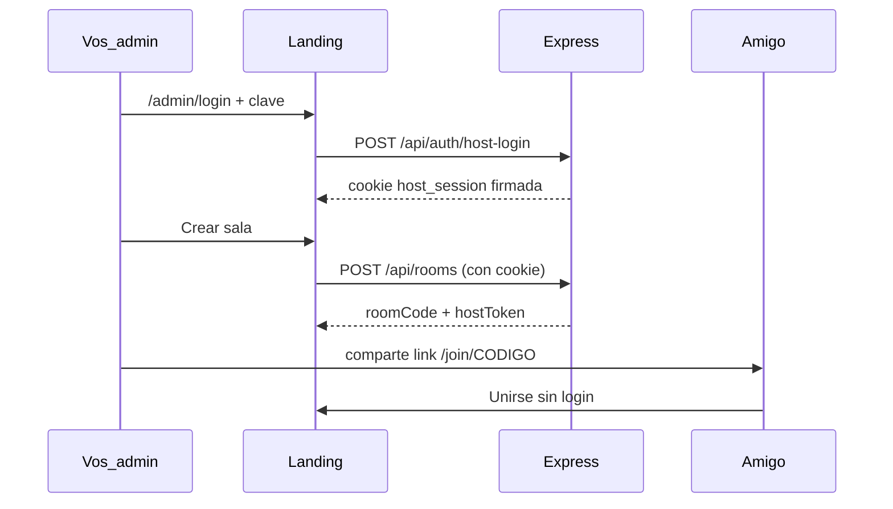
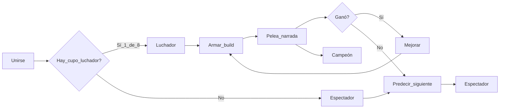
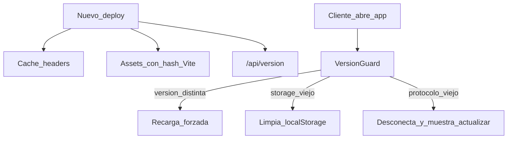

# Torneo de combates con amigos (React + Hostinger)

## Visión del producto

**No es solo para streamers.** Es una web para que **cualquiera** cree una sala, invite amigos con un código/link y jueguen un torneo de 8. Funciona igual si sos streamer (con overlay OBS) o si jugás en privado con amigos.

| Quién | Qué hace |
|-------|----------|
| **Creador de sala (host)** | Crea sala, controla el torneo, comparte link |
| **Luchadores (8)** | Arman build y compiten |
| **Espectadores** | Miran, predicen, ven narración |

### MVP vs visión completa

| | MVP (ahora) | Post-MVP |
|--|-------------|----------|
| **Crear sala** | Solo **vos** (admin autorizado) | Cualquier usuario registrado |
| **Unirse a sala** | Cualquiera con código/link | Igual |
| **Jugar** | 8 luchadores + espectadores | Igual |

---

## Auth MVP: solo vos podés crear salas

Sin base de datos de usuarios en el MVP. Enfoque simple y seguro:

### Flujo



### Implementación recomendada

1. **Variable de entorno** en Hostinger: `HOST_ADMIN_PASSWORD` (clave que solo vos conocés).
2. Página **`/admin/login`**: campo contraseña → `POST /api/auth/host-login`.
3. Si coincide, servidor emite **cookie HTTP-only** `host_session` (JWT firmado con `SESSION_SECRET`, expira en 7 días).
4. **`POST /api/rooms`** y eventos `host_*` en Socket.io exigen cookie válida o `hostToken` de esa sala.
5. Landing pública:
   - **Unirse** → visible para todos.
   - **Crear sala** → redirige a `/admin/login` si no hay sesión; si hay sesión, crea sala.

### Qué NO hacemos en MVP

- Registro público, OAuth Twitch/Google, emails.
- Múltiples admins (opcional: `HOST_ADMIN_PASSWORD` + lista `ALLOWED_HOST_USERNAMES` en v1.1 si hace falta).

### Post-MVP: salas para todos

- Registro con email o login social (Google).
- Cada usuario crea salas desde su cuenta.
- Límite de salas activas por usuario (ej. 1 sala a la vez en plan free).
- Tu cuenta admin sigue existiendo; el resto usa el flujo normal.

---

## Alcance: MVP vs post-MVP

Para el **primer despliegue jugable** se implementa el MVP; el resto queda en Fase 2.

| Incluido en MVP | Post-MVP (Fase 2) |
|-----------------|-------------------|
| Torneo **exclusivo de 8 luchadores** | Más variantes narrativas, arena Tormenta |
| 9 slots + matriz de ventajas | Pool grande + TTS |
| Narrativa automática completa | Mini-player Twitch/Kick |
| Crear sala (solo admin MVP) | Cualquier usuario registrado crea su sala |
| Bracket, panel host, overlay OBS (opcional) | Chat embed |
| Predicciones de espectadores | Notificaciones push / vibración |
| Snapshot en disco + recuperación | Sesión persistente al cambiar de app |
| Cola de espera (tope 48 conexiones) | — |
| Prueba de carga en Hostinger | — |

---

## La idea del juego

Torneo eliminatorio de **exactamente 8 luchadores** por partida. El resto entra como **espectadores** (predicen, ven narración). Cada luchador arma un guerrero con **9 decisiones**, pelea en **arenas aleatorias** con narración automática.



---

## Infraestructura: Hostinger Cloud Startup

### Specs y límites reales

Cloud Startup: **~3 GB RAM, 2 CPU cores**, infraestructura gestionada con límites de **entry processes** concurrentes — orientada a PHP/WordPress, no a un proceso Node persistente con muchas conexiones abiertas.

**Polling only** (sin WebSocket entrante) es correcto, pero el riesgo sigue siendo la cantidad de clientes haciendo long-polling a la vez.

### Límites explícitos del sistema

| Parámetro | Valor | Motivo |
|-----------|-------|--------|
| **Luchadores por torneo** | **8 (fijo)** | Único formato; no hay torneo de 16 ni byes |
| Conexiones máx. en sala | **48** | 8 luchadores + hasta 40 espectadores |
| Intervalo polling lobby | **4 s** | Baja carga entre peleas |
| Intervalo polling pelea | **2 s** | Suficiente para narración por fases |
| Intervalo polling loadout | **3 s** | Compromiso carga/responsividad |

### Degradación con gracia

Si la sala tiene **49+ conexiones**:
1. Los **8 primeros** en unirse ocupan slots de **luchador** (o hasta completar 8).
2. Del 9 al 48 entran como **espectadores** (pueden predecir desde el inicio).
3. El 49+ ve **cola de espera** hasta que se libere un slot de espectador.
4. El host ve: `8/8 luchadores · 34 espectadores · 3 en cola`.

**No hay torneo de 16.** Un nuevo torneo siempre es de 8 luchadores (los mismos u otros según quién esté en lobby al reiniciar).

Si el servidor detecta alta carga (latencia > 3 s en heartbeats):
- Aumentar intervalo de polling a 5 s automáticamente.
- Emitir `phase_alert` a clientes: *"Conexión lenta, ajustando..."*.

### Prueba de carga (obligatoria antes del primer stream)

**No asumir que funciona en local.**

1. Deploy a Hostinger Cloud Startup.
2. Script `scripts/load-test.ts`: simular **50 clientes** Socket.io polling simultáneos.
3. Escenarios: join masivo, fase loadout, 3 peleas secuenciales.
4. Métricas a registrar: CPU/RAM en hPanel, latencia p95, errores 5xx, desconexiones.
5. **Criterio:** p95 < 2 s y 0 crashes durante 10 min de test.

Ítem explícito en todos: `load-test-hostinger`.

---

## Persistencia: snapshot en disco

`TournamentManager` en memoria es un **punto único de fallo**. Si Hostinger reinicia Node (deploy, crash, límite RAM), un torneo en vivo se pierde frente a la audiencia.

### Solución mínima (sin base de datos)

```
data/snapshots/{roomCode}.json   # escrito en cada cambio de fase
```

**Cuándo guardar:** lobby → loadout → fight → upgrade → champion (cada transición).

**Al arrancar el servidor:**
1. Escanear `data/snapshots/`.
2. Si hay snapshot < 2 h de antigüedad → ofrecer recuperar torneo.
3. Host panel muestra: *"Torneo interrumpido detectado — ¿Recuperar?"*.

**Contenido del snapshot:** roomCode, phase, bracket, players, builds, fight queue, narrative history ids (anti-repetición).

**Criterio de éxito explícito:** si el proceso Node se reinicia a mitad de torneo, el host puede recuperar el estado en < 30 s.

---

## Ritmo del torneo (siempre 8 luchadores)

| Ronda | Peleas | Narrativa | Duración estimada |
|-------|--------|-----------|-------------------|
| Cuartos | 4 | Completa (8–12 líneas, ~45–60 s/pelea) | ~4–5 min |
| Semis | 2 | Completa | ~2–3 min |
| Final | 1 | Completa + épica | ~1–2 min |
| Loadouts | 3 fases | — | ~6–9 min |
| **Total** | **7 peleas** | | **~15–25 min** |

Un bracket de 8 encaja en una sesión con amigos (~15–25 min) o en un stream.

## Reglas de torneo

### Cupos: 8 luchadores exclusivos

| Situación | Regla |
|-----------|-------|
| Llegan **1–7** personas | Lobby muestra `X/8 luchadores`; botón **Iniciar** deshabilitado |
| Llega el **8.º** | Host puede iniciar torneo |
| Llega el **9.º+** antes de iniciar | Entra como **espectador** (no compite en este torneo) |
| Luchador se desconecta **antes** de iniciar | Libera slot; el siguiente en cola puede pasar a luchador |
| Luchador se desconecta **durante** torneo | AFK/desconexión: pierde la pelea actual o build congelado (ver abajo) |

**Sin byes.** Siempre son 8 luchadores en el bracket. No se inicia con 6 ni 7.

### AFK / sin confirmar build

| Evento | Regla |
|--------|-------|
| 1ª ronda sin confirmar | Build aleatorio coherente asignado al timeout |
| **2ª ronda consecutiva** sin confirmar | **Eliminado del torneo** (pasa a espectador con predicciones) |
| Desconexión mid-pelea | Sigue con build congelado; si no vuelve en 60 s, pierde la pelea |

### Validación server-side (obligatoria)

El servidor **nunca confía en el cliente** para:
- Que cada slot exista en `equipment.ts` catálogo
- Que arquetipo/arma/escudo sean combinación permitida
- Cálculo de sinergia (cliente solo muestra preview; servidor recalcula)
- Predicciones de espectador: solo durante ventana `pre_fight`, un voto por pelea

```ts
// submit_loadout: rechazar si cualquier slot no está en EQUIPMENT_CATALOG
if (!catalog.isValid(build)) return error('INVALID_BUILD');
```

---

## Espectadores: predicciones (incluido en MVP)

Eliminado en cuartos de un torneo de 8 puede mirar **~10 min** de peleas ajenas. Micro-mecánica barata:

1. Antes de cada pelea, espectadores (y eliminados) ven: *"¿Quién gana: @Ana o @Juan?"* — un tap.
2. Tras la pelea: *"67% predijo a @Ana. Acertaron 42 de 63."*
3. Opcional: ranking de mejores predictores del torneo en pantalla final.

**Eventos:** `submit_prediction`, `prediction_results`.

Coste bajo: ya hay bracket, fase pre-fight y eventos de resultado.

---

## Motor narrativo automático

Siempre modo **completo** (8–12 líneas por pelea, ~45–60 s). Con solo 7 peleas por torneo, no hace falta modo rápido.

### Anti-repetición

- Pool de **≥5 variantes** por categoría de plantilla en MVP (expandir post-MVP).
- `NarrativeEngine` guarda IDs de plantillas usadas en las **últimas 3 peleas**.
- No repetir la misma plantilla en **2 peleas consecutivas**.
- Si el pool se agota, rotar la más antigua.

### El host no escribe mensajes

El juego genera todo el texto. Si transmitís, reaccionás en voz encima; si jugás en privado, la narración en pantalla alcanza.

---

## Loop de partida

### 1. Lobby
- Primeros **8** en la sala = **luchadores** (`Luchador 3/8`).
- Del 9 en adelante = **espectadores** (ya pueden quedarse para el torneo).
- Host inicia solo con **8/8 luchadores**.

### 2. Equipamiento (90–120 s)
9 slots en wizard de 4 pestañas.

### 3. Pelea secuencial (7 peleas total)
Arena aleatoria → narración → simulación → ganador.

### 4. Mejora (sobrevivientes de los 8)
Un slot: mejorar / cambiar / mantener.

### 5. Campeón + podio + ranking predictores

Tras el torneo, host lanza **nuevo torneo de 8** (mismos u otros luchadores según lobby).

---

## Equipamiento (9 slots — sin cambios)

Arquetipo, Estilo | Armadura, Casco, Escudo | Arma, Elemento | Artefacto, Habilidad, Consumible.

Matriz de ventajas y arenas: ver secciones anteriores del plan (sin cambios).

---

## Multi-dispositivo (MVP simplificado)

Juego autocontenido con narración automática. Copy en pantalla guía a quien juega solo desde el celular.

**Post-MVP:** mini-player, chat embed, notificaciones.

> Nadie necesita ver un stream para entender qué pasa.

---

## Arquitectura técnica

| Capa | Tecnología |
|------|------------|
| UI | React 19 + TypeScript + Tailwind |
| Build | Vite |
| Rutas | React Router v7 |
| Estado | Zustand |
| Servidor | Express + Socket.io (`transports: ['polling']`, intervalos adaptativos) |
| Persistencia | JSON snapshots en `data/snapshots/` |
| Hosting | Hostinger Cloud Startup |
| Versionado | `APP_VERSION` + `PROTOCOL_VERSION` + cache headers |

---

## Evolución sin caché rota en dispositivos

Quien jugó la **v1** no debe quedarse con JS viejo, estado local incompatible o sesiones fantasma tras un deploy. Estrategia en capas:



### 1. Assets estáticos (Vite + Express)

| Recurso | Cache-Control | Motivo |
|---------|---------------|--------|
| `index.html` | `no-cache, no-store, must-revalidate` | Siempre pide la shell nueva |
| `/assets/*` (JS/CSS con hash) | `public, max-age=31536000, immutable` | Vite genera `main.a1b2c3.js`; nombre nuevo = sin conflicto |
| `favicon`, etc. | `max-age=86400` | Menor prioridad |

Express sirve `dist/` con middleware que aplica estas reglas según ruta.

**No usar Service Worker en MVP.** Si se añade en post-MVP, debe seguir estrategia *network-first* para `index.html` y limpieza en `activate`.

### 2. Versión de app expuesta al cliente

```ts
// Generado en build (package.json version + git sha corto)
APP_VERSION=1.0.0+abc1234
PROTOCOL_VERSION=1   // incrementar solo en cambios breaking de eventos Socket.io
```

- **`GET /api/version`** → `{ appVersion, protocolVersion, minClientVersion? }`
- Inyectar `import.meta.env.VITE_APP_VERSION` en el bundle del cliente.

### 3. `VersionGuard` (componente React, monta en `App.tsx`)

Al cargar y cada **5 min** en background:

1. Fetch `GET /api/version` (sin cache: `cache: 'no-store'`).
2. Si `appVersion` del servidor ≠ versión del bundle → banner **"Hay una actualización"** + `window.location.reload(true)` al tocar, o reload automático si no está en medio de una pelea.
3. Si `protocolVersion` del cliente < servidor → desconectar Socket.io, limpiar estado Zustand, mostrar pantalla **"Actualizá la página"** (no seguir con protocolo incompatible).
4. Si `minClientVersion` está definido y el cliente es menor → reload forzado.

**Durante pelea activa:** posponer reload hasta `fight_result` o timeout 30 s (evitar perder torneo por deploy accidental).

### 4. Limpieza de almacenamiento local

Prefijo de claves: `soyjere_v{PROTOCOL_VERSION}_` (ej. `soyjere_v1_playerId`).

Al detectar cambio de `PROTOCOL_VERSION` o `APP_VERSION` major:

```ts
// VersionGuard o bootstrap
Object.keys(localStorage)
  .filter(k => k.startsWith('soyjere_') && !k.startsWith(`soyjere_v${CURRENT}_`))
  .forEach(k => localStorage.removeItem(k));
```

Misma lógica para `sessionStorage` si se usa.

**No guardar estado crítico del torneo solo en el cliente** — el servidor es fuente de verdad; al volver tras reload, `join_room` con `playerId` recupera posición si el torneo sigue activo.

### 5. Socket.io y deploy en caliente

- Cliente envía `clientVersion` y `protocolVersion` en `join_room`.
- Servidor rechaza con `error: CLIENT_OUTDATED` si `protocolVersion` no coincide.
- Tras deploy, conexiones viejas se desconectan; el cliente muestra actualizar (no errores silenciosos).

### 6. Checklist en cada release

1. Bump `version` en `package.json` (semver).
2. Si cambian eventos WS o shape de `CharacterBuild` → incrementar `PROTOCOL_VERSION`.
3. Deploy → verificar que `index.html` no se cachea (DevTools → Network).
4. Abrir app en pestaña que tenía v1 anterior → debe pedir actualización o recargar sola.
5. Documentar en `CHANGELOG.md` si hay breaking change.

### Archivos relacionados

```
src/components/system/VersionGuard.tsx
src/lib/storage.ts              # prefijos versionados, purgeLegacyKeys()
src/server/middleware/cache.ts  # headers por tipo de archivo
src/server/routes/version.ts    # GET /api/version
```

### Criterios de éxito (versionado)

Ver sección **Criterios de éxito → Versionado y caché** al final del documento.

---
stateDiagram-v2
  [*] --> Lobby
  Lobby --> Loadout: host_inicia_8
  Loadout --> PreFight: builds_listos
  PreFight --> FightSim: predicciones_cerradas
  FightSim --> FightResult: simulacion
  FightResult --> Upgrade: quedan_rondas
  FightResult --> Champion: final
  Upgrade --> Loadout: siguiente_ronda
  Champion --> Lobby: nuevo_torneo
```

## Estructura del proyecto

```
src/
├── pages/          # Landing, Join, AdminLogin, CreateRoom, Lobby, Play, Host, Overlay
├── components/
│   ├── loadout/    # LoadoutWizard, SlotPicker, SynergyMeter...
│   ├── fight/      # FightAnimation, HealthBars
│   ├── narration/  # NarrationFeed, ArenaBanner, MatchupCard
│   ├── tournament/ # BracketView, ChampionScreen, PredictionPoll
│   ├── lobby/
│   │   └── PlayerList.tsx, WaitQueue
│   └── system/
│       └── VersionGuard.tsx, UpdateBanner
├── lib/
│   └── storage.ts  # claves versionadas, purge legacy
├── hooks/
├── stores/
├── types/
└── server/
    ├── index.ts
    ├── TournamentManager.ts
    ├── FightSimulator.ts
    ├── NarrativeEngine.ts
    ├── StateSnapshot.ts      # guardar/recuperar JSON
    ├── ConnectionLimiter.ts
    ├── HostAuth.ts
    ├── middleware/
    │   └── cache.ts
    ├── routes/
    │   └── version.ts
    ├── rules/
    └── narration/
data/snapshots/               # gitignored
scripts/load-test.ts          # prueba de carga
```

## Rutas

| Ruta | Pantalla | Acceso |
|------|----------|--------|
| `/` | Landing: unirse o crear sala | Público |
| `/admin/login` | Login admin (clave) | Público |
| `/create` | Crear sala | Solo sesión admin MVP |
| `/join/:code` | Nickname | Público |
| `/lobby/:code` | Espera | Con código |
| `/play/:code` | Juego según fase | Con código |
| `/host/:code` | Panel creador (`?token=`) | hostToken |
| `/overlay/:code` | OBS (opcional) | Público con código |

## Eventos Socket.io

**Cliente → servidor:** `join_room` (+ `clientVersion`, `protocolVersion`), `submit_loadout`, `submit_upgrade`, `submit_prediction`, `host_start_tournament`, `host_next_fight`, `host_recover_snapshot`, `host_kick`

**Servidor → cliente:** `room_state`, `queue_position`, `tournament_bracket`, `loadout_phase_start`, `pre_fight_start`, `narration_line`, `fight_tick`, `fight_result`, `prediction_results`, `upgrade_phase_start`, `champion_crowned`, `phase_alert`, `server_degraded`, `error` (incl. `CLIENT_OUTDATED`)

---

## Flujo Git (un push por etapa)

Cada ítem del plan del MVP se entrega en **un commit + un push** a `origin/main`:

1. Completar el todo (código funcional de esa etapa).
2. Actualizar en `README.md`: marcar la fila como `hecho` y ajustar **Etapa actual** si corresponde.
3. Marcar el todo como `completed` en el frontmatter del plan.
4. Commit con mensaje: `feat(etapa-N): descripción breve`.
5. `git push origin main`.

Los todos post-MVP (`post-mvp-*`) siguen el mismo criterio cuando se aborden.

---

## Fases de implementación

### Fase A — Base + infra + auth admin + versionado
- Scaffold, Socket.io polling, `ConnectionLimiter`, `StateSnapshot`
- `HostAuth`, `cache.ts`, `GET /api/version`, `VersionGuard`

### Fase B — Torneo de 8 (único formato)
- `TournamentManager`: bracket fijo 8, sin byes, roles luchador/espectador
- Lobby con cupos `8 luchadores + espectadores`

### Fase C — Equipamiento + combate
- 9 slots, `FightSimulator`, fase upgrade
- `NarrativeEngine` con anti-repetición básica

### Fase D — MVP jugable (reducida)
- `NarrationFeed`, `FightAnimation`, `PredictionPoll`
- Host panel simple, overlay OBS básico
- **Sin** mini-player, chat embed, push

### Fase E — Deploy + load test + verificación de caché
- Deploy Hostinger
- Load test 50 clientes
- **Test manual post-deploy:** pestaña con versión anterior debe actualizar sin UI rota

### Fase 2 (post-MVP)
- **Cuentas abiertas:** registro/login; cualquiera crea sala
- Mini-player Twitch/Kick, chat embed (útil para streamers)
- Notificaciones, sesión persistente
- Pool narrativo ampliado

---

## Fuera de alcance (siempre)

- Torneo de 16 u otro tamaño de bracket
- Byes o iniciar con menos de 8 luchadores
- Login Twitch / avatares
- Mensajes manuales del creador de sala
- Registro público / OAuth (hasta post-MVP)
- Service Worker sin estrategia de actualización (no en MVP)
- Base de datos (solo JSON snapshots)
- Peleas en paralelo

## Fuera de alcance del MVP

- Ítems listados en Fase 2 post-MVP

---

## Criterios de éxito

### Juego
1. Viewer en celular completa build de 9 slots en < 2 min.
2. Torneo de **8 luchadores** completo en **~15–25 min** (sin iniciar con menos de 8).
3. Narración automática coherente (ventajas, arena, golpes, resultado).
4. Espectadores predicen y ven % de aciertos tras cada pelea.
5. Overlay OBS muestra bracket + narración + vida.

### Infraestructura
6. Máximo **48** conexiones; la 49ª entra en cola con mensaje claro.
7. Load test de **50 clientes** en Hostinger pasa (p95 < 2 s, sin crash 10 min).
8. Tras reinicio de Node, host **recupera torneo** desde snapshot en < 30 s.

### Auth y producto
9. Sin sesión admin, **no se puede crear sala**; unirse sigue público.
10. Con sesión admin, crear sala devuelve `roomCode` + link para compartir con amigos.

### Multi-dispositivo
11. Jugador solo-celular termina torneo sin app externa.

### Versionado y caché
12. Tras deploy nuevo, cliente con versión vieja actualiza sin JS mezclado ni UI rota.
13. `index.html` sin cache agresivo; assets con hash inmutables.
14. Protocolo incompatible → mensaje claro `CLIENT_OUTDATED`, no errores silenciosos.
